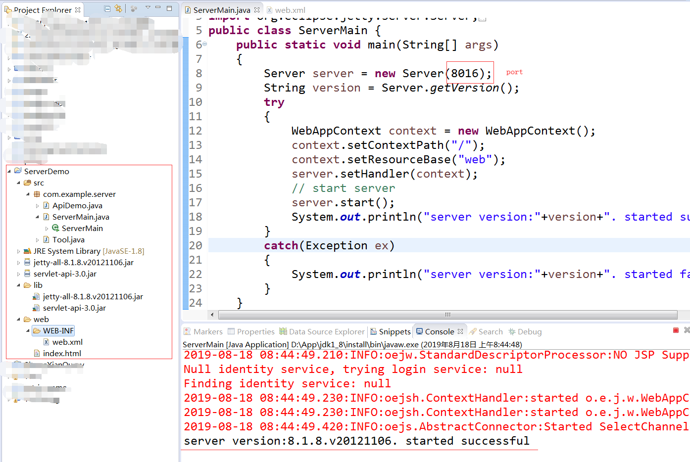
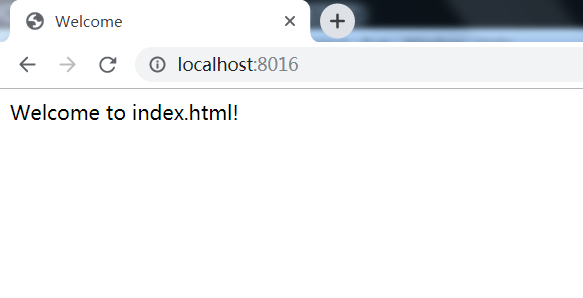
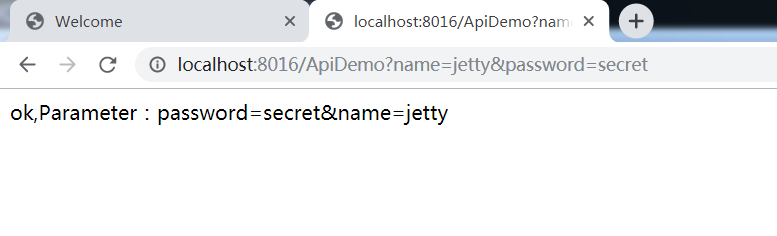

# Jetty
Eclipse Jetty provides a Web server and javax.servlet container, plus support for HTTP/2, WebSocket, OSGi, JMX, JNDI, JAAS and many other integrations. 

# Environment
Jetty version: 0.0

Eclipse version: Luna Service Release 2 (4.4.2)

OS platform: win7

Java version: Java1.8

# Demonstration

